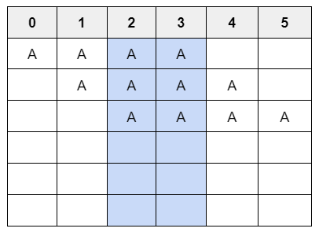
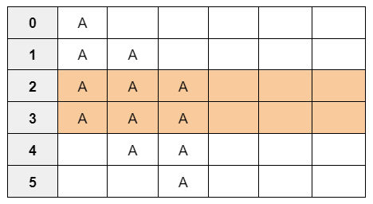
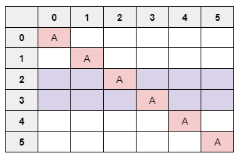
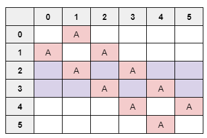
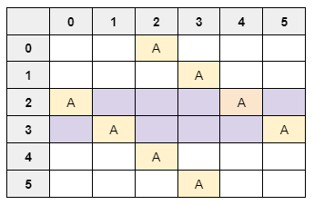
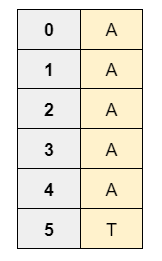

# DESAFÍO: MUTANTES
Programación I - Desafío Mercado Libre
### Datos Personales:
* Nombre y Apellido: Giuliana Fragapane
* Legajo: 51529
* Email: giulianafragapanepravatta@gmail.com
## Proyecto
* Consigna:
<p align="justify">
Magneto quiere reclutar la mayor cantidad de mutantes para poder luchar contra los X-Mens. Te contrata para que desarrolles un proyecto que detecte si un humano es mutante basándose en su secuencia de ADN, utilizando la siguiente función: boolean isMutant(String[] dna), donde recibirás como parámetro un array de Strings que representan cada fila de una tabla de (6x6) con la secuencia del ADN. Ingrese por teclado las filas de la matriz, cargando las mismas.

Las letras de los Strings solo pueden ser: (A,T,C,G), las cuales representan cada base nitrogenada del ADN.
Sabrás si es mutante si encuentras MÁS DE UNA SECUENCIA de cuatro letras iguales, de forma oblicua (de derecha a izquierda y viceversa), horizontal o vertical.

#### Ejemplo (Caso mutante):
String[] dna = {"ATGCGA","CAGTGC","TTATGT","AGAAGG","CCCCTA","TCACTG"};
En este caso el llamado a la función isMutant(dna) devuelve “True”.

Desarrolla el algoritmo de la manera más eficiente posible.
</p>

## Abordaje
### Algoritmo
- Primero el usuario debe ingresar las filas de la matriz, donde cada una de ellas será analizada para evitar errores (ingresar letras incorrectas o no respetar el tamaño de la matriz). Se busco crear una interfaz clara con mensajes de salida informativos.
- Luego, el programa llamará a la función isMutant(dna) la cual contiene otras funciones para la búsqueda de secuencias horizontales, verticales y oblicuas. Primero analizará la existencia de secuencias horizontales, luego verticales, oblicuas (derecha a izquierda) y por último oblicuas (de izquierda a derecha). Para evitar recorrer todos los bucles de cada función, primero, antes de pasar al próximo análisis, verificará si ya se encontró más de una secuencia, si es así, no continuará con el código siguiente y retornará True.
- Cada función interna usa la función control_sequence(secuencia), que analiza cada secuencia enviada, verificando si hay alguna de las cadenas indicadas ('AAAA', 'TTTT', 'CCCC' o 'GGGG') y devolviendo True en caso de coincidencia. La secuencia enviada es una cadena de 4 bases que se extrae de la matriz en las diferentes direcciones.
- Para optimizar más el código, dentro del análisis horizontal y vertical establecí condiciones para evitar entrar en el bucle anidado ya que cada posible opción de secuencia, para el caso horizontal, siempre ocuparán las columnas 2 y 3. De manera vertical ocuparán las filas 2 y 3.
Si en dichas posiciones las letras son iguales, ya existe la posibilidad de que exista una secuencia y el algoritmo lo analizará, caso contrario, si hubieran letras diferentes ya se elimina la posibilidad de que exista una secuencia porque no se podría formar ninguna de las 3 posibilidades y se evitará.



- Para la creación de las estructuras de código en los casos diagonales, se analizaron también las posibles secuencias por cada diagonal. Se puede visualizar que siempre para estos casos también se ocupan las filas 2 y 3.

1. La diagonal principal permite 3 posibles secuencias:



2. Las diagonales a la izquierda y derecha de la principal permiten 2 posibilidades:



3. Y las últimas diagonales posibles permiten 1 posibilidad:



- Por pantalla se mostrarán las secuencias encontradas. Si se trata de un mutante se visualizarán las dos primeras coincidencias encontradas ya que con tener más de una es motivo suficiente para considerarse mutante.
- Si el programa luego de recorrer cada función (todas las direcciones), no encuentra más de una secuencia, retornará False.
- Es importante saber que el algoritmo considera más de una secuencia si por ejemplo, verticalmente se encuentra más de una posibilidad. Como vemos en la imagen de abajo, hay dos posibilidades, de la posición (0 a 3) y de (1 a 4). Esto sucede para cada caso de búsqueda.

### Contenido del repositorio
- Archivo mainMutantes.py es el archivo para que el usuario ingrese cada fila de la matriz.

    EJEMPLOS PARA INGRESAR:
    
    1. Para obtener un mutante (orden de filas: 1-6): 
    ```             
    CGTAAT 
    ``` 
    ```
    TTGGCT 
    ```
    ```
    ACCCCT 
    ```
    ```
    TACGGT 
    ```
    ```
    ACATAA 
    ```
    ```
    TGTACC
    ```
    2. Para obtener un no mutante (orden de filas 1-6):
    ```             
    ACGTAG
    ``` 
    ```
    CAGCAC 
    ```
    ```
    GCTACT 
    ```
    ```
    CATTAG 
    ```
    ```
    ACGACC 
    ```
    ```
    ATGGGG
    ```
- Archivo mutantes.py tiene una matriz de ejemplo que cumple con los requisitos de mutante.
- Archivo nomutantes.py tiene también una matriz de ejemplo y es para el caso de no mutante.
## Cómo correrlo
- Abre Git Bash en el directorio donde deseas clonar el repositorio. 
Puedes usar el comando cd para navegar a la ubicación deseada.
```
cd ubicacion-deseada
```
- Clona el repositorio ejecutando el siguiente comando:
``` 
git clone https://github.com/giulifragapane/MUTANT.git
```
- Navega al directorio donde se encuentra el repositorio clonado. Utiliza el comando cd para cambiar al directorio del repositorio.
``` 
cd tu-repositorio
```
- Ahora, para abrir todo el directorio del repositorio ve a Visual Studio Code y abre la carpeta.
- Una vez abierta la carpeta, dirígete al archivo principal mainMutantes.py.
